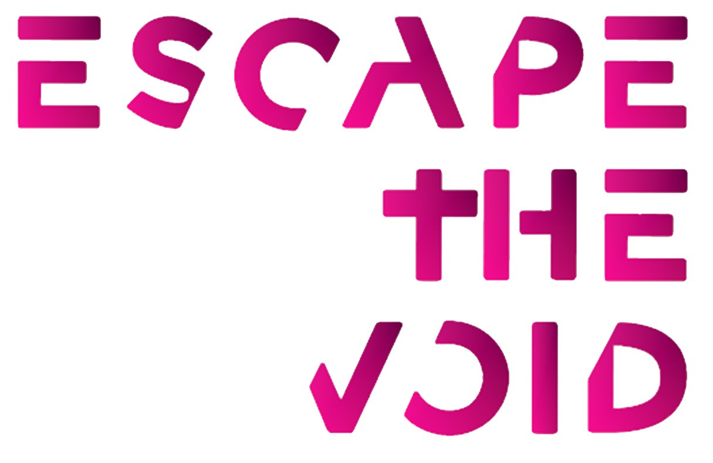

# Escape The Void

**Escape The Void** è un prototipo di videogioco in realtà virtuale sviluppato per **Meta Quest 2** utilizzando **Unity**.  

🕹️ **Progetto realizzato per l'esame di Realtà Virtuale**  
📚 **Corso di Informatica Magistrale - Università degli Studi di Milano**  

## 🎮 Descrizione del Gioco  
Il gioco è composto da una serie di **escape room**, in cui l'obiettivo è trovare la porta di uscita.  
La particolarità del **game design** è l'assenza di dettagli visibili nell'ambiente circostante:  
tutto è completamente **bianco**.  
L'unico modo per orientarsi è **colorare lo spazio intorno a sé**, rivelando gradualmente la struttura della stanza.  

L'idea prende ispirazione dal videogioco *The Unfinished Swan*, adattandone il concetto alla realtà virtuale.  

## 🎥 Trailer  
  

🔗 **Guarda il video qui:** [Clicca per vedere](https://drive.google.com/file/d/1Lx8VEMUNR3AfcD5ZCAwgweieyD4lokyb/view?usp=drive_link)  

